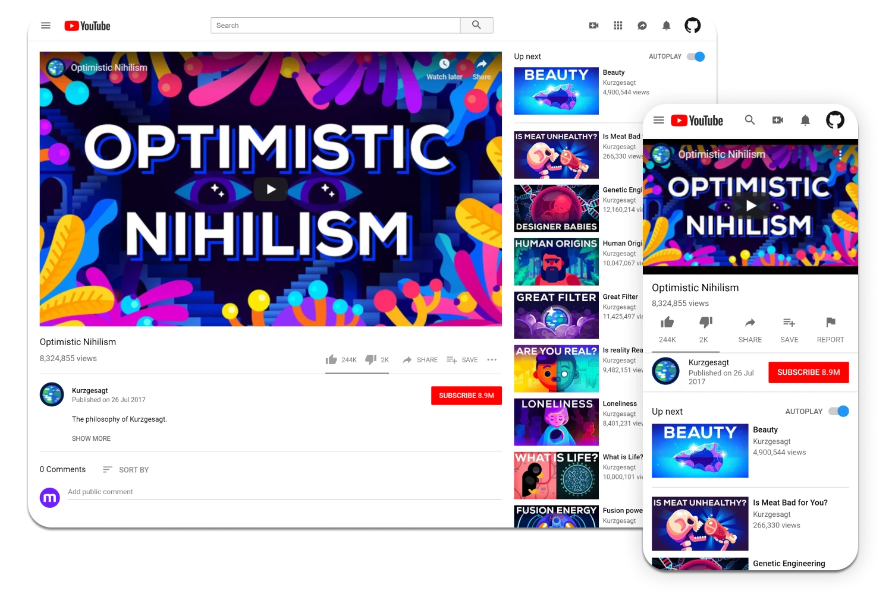

<h1 align="center">Welcome to Youtube video-player page clone 👋</h1>

  
  

> A clone of [YouTube video player page](https://www.youtube.com/watch?v=jNQXAC9IVRw)

### ✨ [Demo](https://nazeh.github.io/youtube_video_player_page/)

### Built with

* HTML5
* CSS3

## Author

👤 **Nazeh**

* Website: [nazeh.me](https://www.nazeh.me/)
* Twitter: [@arnazeh](https://twitter.com/arnazeh)
* Github: [@nazeh](https://github.com/nazeh)
* LinkedIn: [@arnazeh](https://linkedin.com/in/arnazeh)

👤 **Abdusaid**
* Github: [@Abdusaid10](https://github.com/Abdusaid10)

## Show your support

Give a ⭐️ if this project helped you!

***
_This README was generated with ❤️ by [readme-md-generator](https://github.com/kefranabg/readme-md-generator)_